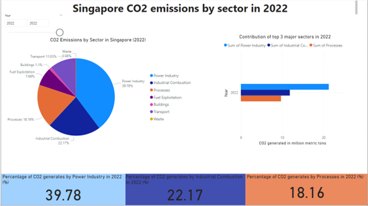

# JIE Sustainability — Carbon Emissions Data Analytics (CRISP-DM)

A data analytics project that explores **Singapore’s CO₂ emissions** across time, sectors, and international benchmarks—then turns the insights into **Power BI dashboards** and **actionable recommendations**.

---

## 📌 Project Overview

This project investigates how Singapore’s emissions relate to economic growth, how Singapore compares against other developed Asian economies and the global average, and which sectors contribute most to emissions—using the **CRISP-DM** workflow (Business Understanding → Data Understanding → Data Preparation → Visualisation → Conclusion). 

---

## 🎯 Business Problem & Objectives

### Problem
Global energy demand and consumption has surged since 1970, increasing CO₂ emissions and climate risks. The project frames this in the context of **Singapore’s sustainability pathway** and net-zero direction. 

### Business Objectives
- Analyse Singapore’s emissions trends to support progress tracking toward **Net Zero 2050**
- Identify high-emission sectors and propose strategies for reduction

### Data Mining Goals
1. Relationship between **annual CO₂ emissions** and **GDP**
2. Compare **per-capita CO₂ emissions** (Singapore vs developed Asian economies + global average)
3. Identify the **top 3 emitting sectors** in Singapore (2022)
4. Analyse the **last 10 years** of contributions for the top sectors and propose reductions 

---

## 🧠 Methodology (CRISP-DM)

### 1) Business Understanding
Defined the sustainability problem and analytics goals

### 2) Data Understanding
Key constraints and assumptions included:
- Some datasets were limited / inconsistent in format
- Data coverage up to **2022**
- Assumed sector emissions fully partition total emissions (sector totals ≈ annual totals)
- Dropped null/duplicate rows as data errors 

### 3) Data Preparation
Performed cleaning, reshaping, aggregation, and merges to produce Power BI-ready tables

### 4) Visualisation
Built **4 dashboards** (Power BI) to answer each goal with charts + slicers + rankings

### 5) Conclusions & Recommendations
Delivered findings plus policy-style recommendations (e.g., EV incentives, energy audits, renewables). 

---

## 🗂️ Data Sources

This project uses publicly available datasets (compiled into CSVs), including:
- [**EDGAR**](https://edgar.jrc.ec.europa.eu/report_2022) (Emissions Database for Global Atmospheric Research)
- [**Our World in Data**](https://ourworldindata.org/population-growth) (population & CO₂ context)
- [**World Bank**](https://data.worldbank.org/indicator/NY.GDP.MKTP.CD) (GDP current US$) 

---

## 📄 Datasets Used

Loaded and processed 6 core tables for analysis:
- `co2_emission_countries.csv` — annual total CO₂ emissions by country
- `co2_per_capita_countries.csv` — annual CO₂ per capita by country
- `co2_per_gdp_countries.csv` — annual CO₂ per GDP by country
- `co2_sector_countries.csv` — annual CO₂ by sector and country
- `gdp_countries.csv` — GDP by country/year
- `population.csv` — population by country/year 

---

## 📊 Dashboards (Power BI)

- **Dashboard 1:** CO₂ vs GDP trend exploration and correlation over time
  
- **Dashboard 2:** Singapore per-capita emissions vs developed Asian economies + global average
  
- **Dashboard 3:** Singapore emissions by sector (2022) + top contributors
  
- **Dashboard 4:** 10-year trend of the top sectors + recommendations
  

---

## ✨ Key Insights (High-Level)

- Singapore’s **per-capita emissions** remain above the global average across decades, indicating stronger reduction efforts are needed
- The largest emission contributions are driven by a small number of sectors (e.g., power/industry/process-related), motivating targeted interventions 

---

## 💡 Recommendations (Examples)

A few recommendations proposed in the analysis include:
- Strengthen **EV incentives** (e.g., improve replacement/tax rebate schemes)
- Improve building sustainability policies (e.g., **mandatory energy audits** at regular intervals)
- Accelerate **renewables adoption** and enforce controls on high-emission activities 

---

## 🛠️ Tools & Tech Stack

- **Python (Google Colab)**: cleaning, reshaping, merges, exporting cleaned CSVs  
- **Pandas**: data wrangling  
- **Power BI / Power Query**: transformation + dashboards

---

## 👤 Author & Credits

Optiflow was developed by:
- **Lim Jin Bin**
- **Issac Lim**
- **Edric Sng Hong Kai**

**Programme:** Y2 AI & Data Engineering — Nanyang Polytechnic  
**Module:** Data Preparation & Visualisation

